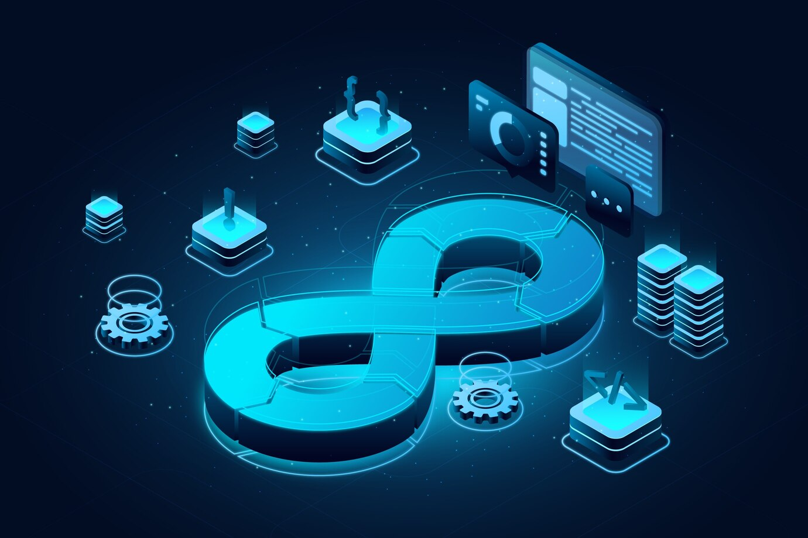

#    Hola Mundo, Soy  Oscar Florín 
## Ingeniero en Comunicaciones y Electrónica con 13 años de experiencia, Freelance. AWS Arquitecto de Soluciones nivel Asociado, practicante de la nube GCP. | IPN OWC |.

## Soy Ingeniero egresado de ESIME unidad Culhuacán, con mas de 13 años de experiencia.

### En Septiembre del 2022 estoy trabajando de la mano con StartUps, migrando, administrando y desarrollando sus servicios en la nube, enfocando mi carrera profesional en soluciones cloud. Desde el 2019 me he dedicado a especializarme en el desarrollo soluciones y aplicaciones en la nube, colaborando en distintos sectores de la tecnología de la información. 

## Obteniendo 6 certificaciones de AWS, como son:

### - AWS Solutions Architect - Associate
### - Serverless
### - S3 Specialist
### - EBS Specialist
### - EFS Specialist
### - Core Store Specialist

## Obteniendo 5 certificaciones de GCP, como son:

### - Google Cloud Essentials
### - Google Cloud Computing Foundations: Data
### - Google Cloud Computing Foundations: Networking & Security
### - Google Cloud Computing Foundations: Infrastructure
### - Google Cloud Computing Foundations: Cloud Computing

## En Febrero del 2024 tome la decisión de hacer este repositorio, para que pueda ser una guía de apoyo para colaboradores, colegas y estudiantes de habla hispana.

## Tecnologías:

[-1575F9?style=for-the-badge&logo=amazon-aws&logoColor=white&labelColor=101010)](https://www.credly.com/badges/2b8dc8f8-18f9-43d6-b4f6-11152def44b5/public_url)

 

 

 

 

### Y más...

## Encuéntrame:

# --> Proyectos: <--

## - Optimización de entornos Linux - RedHat y macOS 
## - Primeros pasos en VSC

# Puedes seguir y apoyar mi trabajo haciendo click en "☆ Star"
# ¡Muchas gracias, bienvenido!!!

# Contacto y apoyo:

 
  
